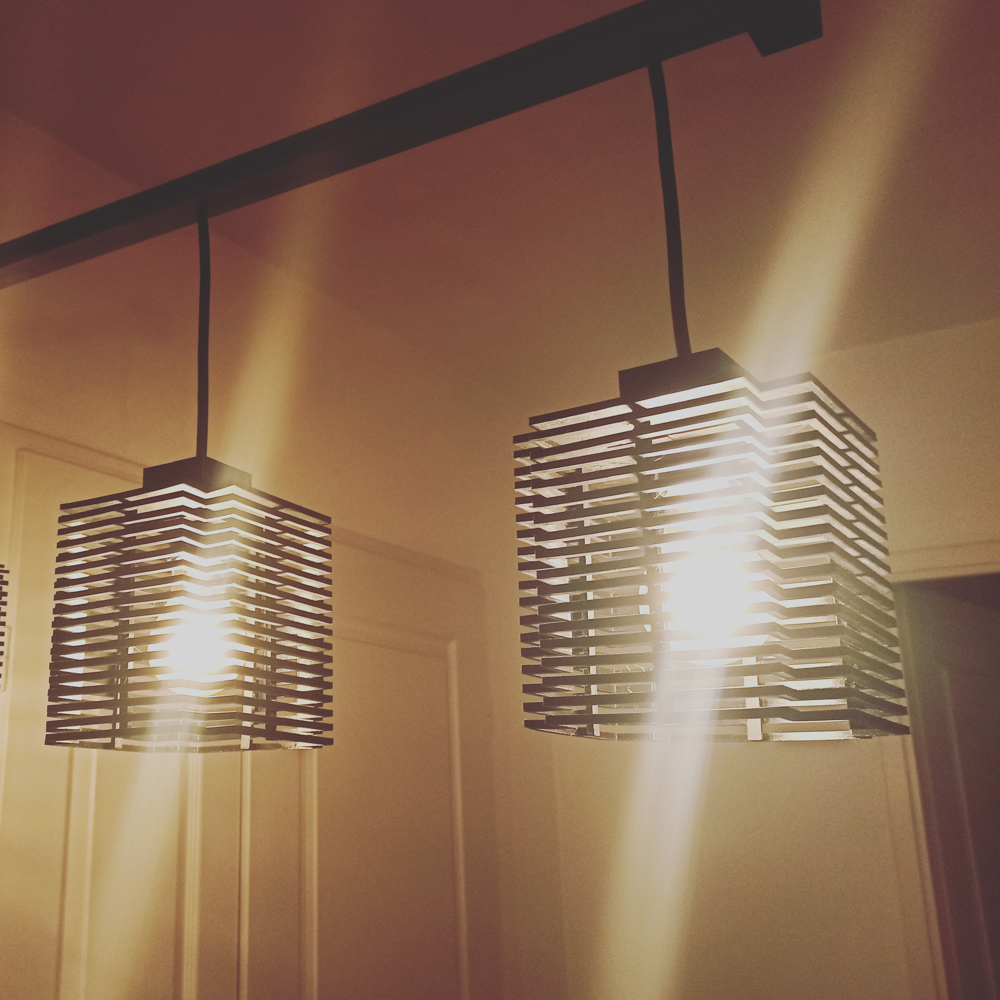
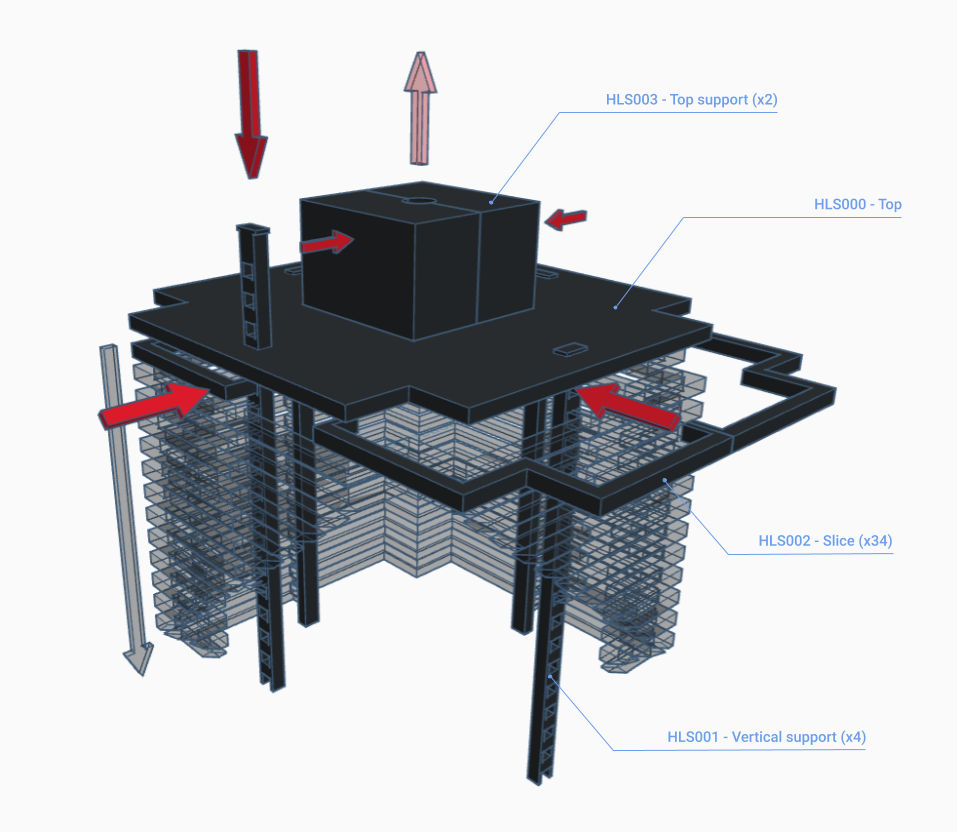

# STL-Habbi-Lamp-Shade

## Informations

/////////////////////////////////////

:earth_africa: :fr:

Un abat-jour imprimable en 3D.
Fil de lampe ø: 8mm
Douille de lampe ø: 40mm max

4 parties:
- [Top](./parts/HLS000-top/)
- [Vertical support](./parts/HLS001-vertical-support/)
- [Slice](./parts/HLS002-slice/)
- [Top support](./parts/HLS003-top-support/)

/////////////////////////////////////

:earth_americas: :us:

A 3D printable lamp shade.
Lamp wire ø: 8mm
Lamp socket ø: 40mm max

4 parts:
- [Top](./parts/HLS000-top/)
- [Vertical support](./parts/HLS001-vertical-support/)
- [Slice](./parts/HLS002-slice/)
- [Top support](./parts/HLS003-top-support/)

/////////////////////////////////////

## Schema

## Platforms

- [Thingiverse](<to do>)
- [Cults3D](<to do>)

## Licence

©© Creative Commons - Attribution - NonCommercial - ShareAlike

[CC BY-NC-SA 4.0](https://creativecommons.org/licenses/by-nc-sa/4.0/)
